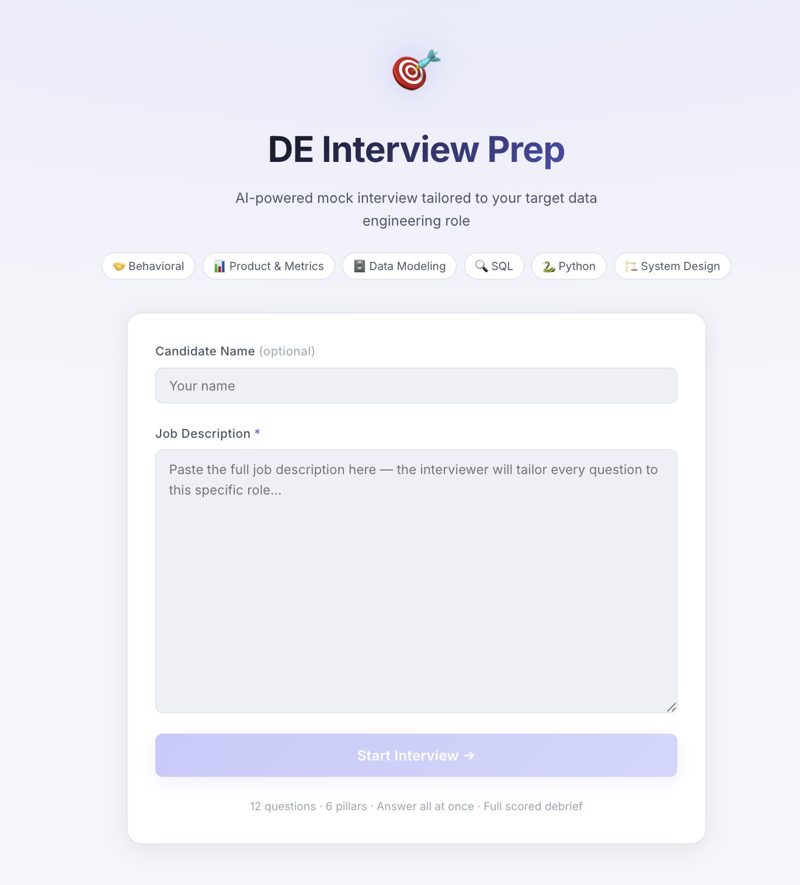
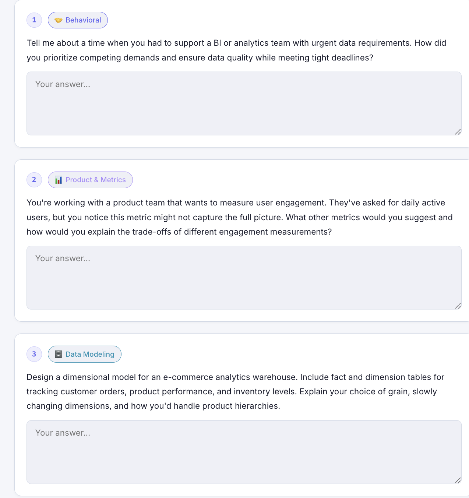

# DE Interview Prep — AI Mock Interviewer for Data Engineers

An AI-powered mock interview tool that reads a real job description and generates 12 tailored interview questions across 6 data engineering pillars. Answer everything at once, then get a full scored debrief instantly.

Built with **React + Vite** on the frontend and **Express + Claude API** on the backend.

---

## Screenshots

### Setup


### Interview Questions


---

## How It Works

The entire interview runs in **2 API calls** — no back-and-forth, no wasted tokens:

1. **Generate** — paste a job description → Claude produces 12 tailored questions across all 6 pillars
2. **Evaluate** — submit all answers at once → Claude scores each pillar and returns a full debrief

---

## Interview Pillars

| Pillar | Focus |
|---|---|
| 🤝 Behavioral | Teamwork, ownership, impact, conflict |
| 📊 Product & Metrics | KPIs, north-star metrics, anomaly analysis |
| 🗄️ Data Modeling | Schema design, normalization, star schema |
| 🔍 SQL | Queries against concrete schemas provided in each question |
| 🐍 Python | Pandas, PySpark, debugging, writing functions |
| 🏗️ System Design | Batch/streaming pipelines, ETL at scale, data lakes |

---

## Tech Stack

| Layer | Tech |
|---|---|
| Frontend | React 18, Vite |
| Backend | Express, Node.js |
| AI | Anthropic Claude (`claude-sonnet-4-20250514`) |
| Prompt caching | `cache_control: ephemeral` on system prompt |

---

## Getting Started

### Prerequisites

- Node.js 18+
- An [Anthropic API key](https://console.anthropic.com/)

### 1. Clone the repo

```bash
git clone https://github.com/your-username/DE_AI_Interviewer.git
cd DE_AI_Interviewer
```

### 2. Install dependencies

```bash
npm install
```

### 3. Set up environment variables

Create a `.env` file in the root:

```env
ANTHROPIC_API_KEY=sk-ant-...
```

### 4. Run in development

```bash
npm run dev
```

This starts both the Express API server (port 3001) and the Vite dev server (port 5173) concurrently.

Open [http://localhost:5173](http://localhost:5173) in your browser.

### 5. Build for production

```bash
npm run build
npm start
```

---

## Project Structure

```
DE_AI_Interviewer/
├── src/
│   ├── App.jsx          # All screens and components
│   ├── App.css          # Styles (light theme)
│   └── main.jsx         # React entry point
├── server.js            # Express API + Claude integration
├── vite.config.js       # Vite + API proxy config
├── assets/              # Screenshots for README
└── .env                 # API key (not committed)
```

---

## Environment Variables

| Variable | Description |
|---|---|
| `ANTHROPIC_API_KEY` | Your Anthropic API key |
| `PORT` | Server port (default: `3001`) |

---

## License

MIT
